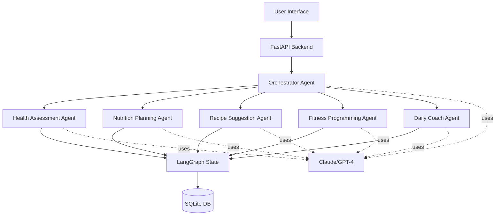
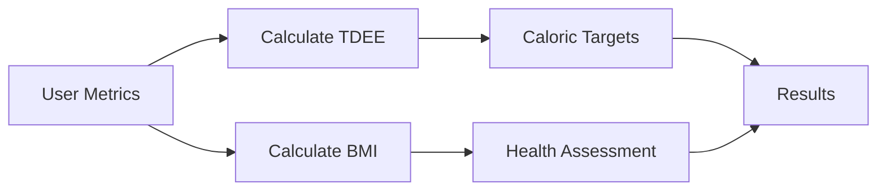
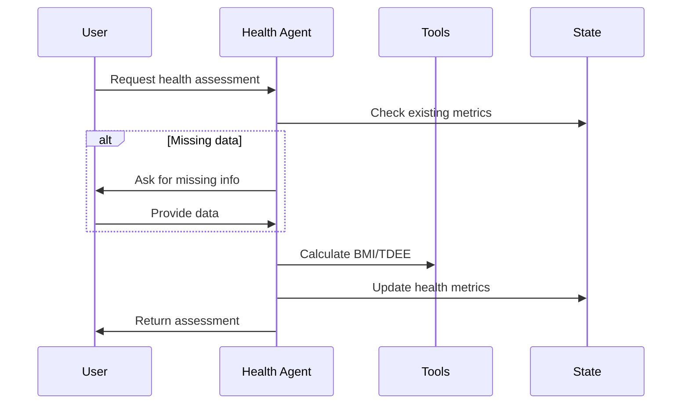
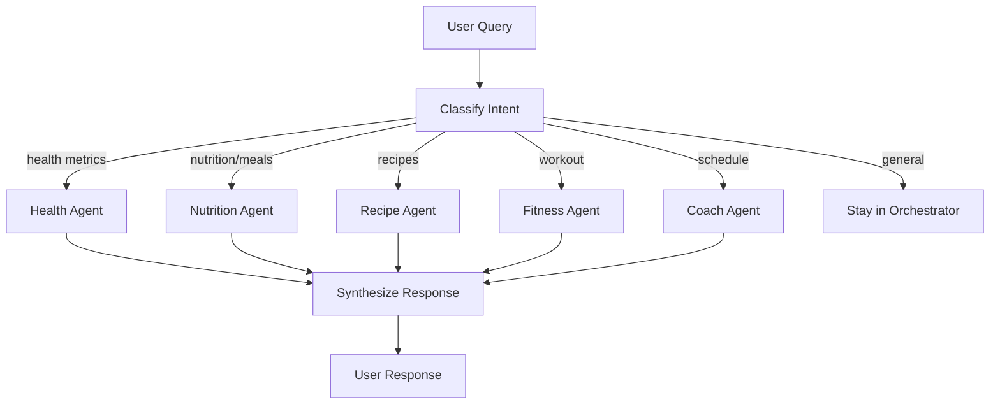

# AI-Powered Fitness Pal - Implementation Plan

## Architecture Overview



## Phase 0: Foundation Setup

### Project Structure

Create the complete project structure with all necessary configuration files:

```
fitness-pal/
├── src/
│   ├── agents/          # Agent implementations
│   ├── models/          # Pydantic models and state schemas
│   ├── utils/           # Helper functions and calculations
│   ├── api/             # FastAPI routes
│   ├── database/        # Database models and repositories
│   └── config.py        # Configuration management
├── tests/
│   ├── unit/            # Unit tests for each component
│   ├── integration/     # Integration tests for agent communication
│   └── e2e/             # End-to-end workflow tests
├── frontend/            # Simple web UI
│   ├── static/
│   └── templates/
├── requirements.txt
├── .env.example
├── pytest.ini
└── README.md
```

### Core Files to Create

**[requirements.txt](requirements.txt)** - Dependencies:

```
langgraph>=0.0.26
langchain>=0.1.0
langchain-anthropic>=0.1.0
langchain-openai>=0.1.0
fastapi>=0.104.0
uvicorn>=0.24.0
pydantic>=2.5.0
pydantic-settings>=2.1.0
python-dotenv>=1.0.0
sqlalchemy>=2.0.0
alembic>=1.13.0
pytest>=7.4.3
pytest-asyncio>=0.21.1
pytest-cov>=4.1.0
httpx>=0.25.0
jinja2>=3.1.2
```

**[.env.example](.env.example)** - Configuration template:

```
# LLM Configuration
LLM_PROVIDER=claude  # claude or openai
ANTHROPIC_API_KEY=your_key_here
OPENAI_API_KEY=your_key_here

# Database
DATABASE_URL=sqlite:///./fitness_pal.db

# API
API_HOST=0.0.0.0
API_PORT=8000
DEBUG=true
```

**[src/config.py](src/config.py)** - Settings management using Pydantic settings

## Phase 1: Core Calculation Utilities (Week 1)

### Implementation Order

1. Health calculation functions (BMI, TDEE, caloric targets)
2. Validation utilities
3. Comprehensive unit tests

**[src/utils/calculations.py](src/utils/calculations.py)** will contain:

- `calculate_bmi(weight_kg, height_cm)` - BMI calculation with category
- `calculate_tdee(weight, height, age, gender, activity_level)` - Mifflin-St Jeor equation
- `calculate_caloric_targets(tdee, goal)` - Deficit/surplus calculations with safety limits
- `assess_health_status(bmi)` - Health recommendations

**[tests/unit/test_calculations.py](tests/unit/test_calculations.py)** - Test cases:

- Normal ranges (BMI 18.5-24.9, various activity levels)
- Edge cases (extreme values, boundary conditions)
- Error cases (negative values, zero divisions)
- Safety limits (minimum 1200 calorie floor)



## Phase 2: State Schema & Database (Week 1-2)

### State Management

**[src/models/state.py](src/models/state.py)** - LangGraph state schema:

- `UserProfile` - Basic user information
- `HealthMetrics` - BMI, TDEE, caloric targets
- `MealPlan` - Nutrition details
- `WorkoutPlan` - Fitness program
- `DailySchedule` - Coach recommendations
- `AgentState` - Global state with message history

### Database Models

**[src/database/models.py](src/database/models.py)** - SQLAlchemy models:

- `User` - User profiles with timestamps
- `HealthHistory` - Track weight, BMI over time
- `MealPlanHistory` - Store meal plans
- `WorkoutHistory` - Track completed workouts
- `ConversationHistory` - Chat logs

**[src/database/repositories.py](src/database/repositories.py)** - Data access layer with async operations

## Phase 3: Health Assessment Agent (Week 2)

First complete agent implementation with full testing.

**[src/agents/health_assessment.py](src/agents/health_assessment.py)**:

- Tool for gathering user metrics (if missing)
- Calculation integration using utils
- Structured output generation
- Conversational prompts for missing data

**Agent Workflow:**



**Tests:**

- [tests/unit/test_health_agent.py](tests/unit/test_health_agent.py) - Agent logic
- [tests/integration/test_health_agent_flow.py](tests/integration/test_health_agent_flow.py) - Complete flows

## Phase 4: Nutrition Planning Agent (Week 3)

**[src/agents/nutrition_planning.py](src/agents/nutrition_planning.py)**:

- Meal plan generation based on caloric targets
- Macro distribution (protein/carbs/fat ratios)
- Dietary preference handling (vegetarian, vegan, keto)
- Meal timing and portions

**Key Features:**

- Read health metrics from state
- Generate balanced meals for breakfast, lunch, dinner, snacks
- Ensure macro targets are met
- Respect dietary restrictions

**Tests:**

- Validate caloric accuracy (±50 calories)
- Test all dietary preferences
- Edge cases (very low/high calorie targets)
- Macro distribution validation

## Phase 5: Recipe Suggestion Agent (Week 3)

**[src/agents/recipe_suggestion.py](src/agents/recipe_suggestion.py)**:

- Ingredient-based recipe matching
- Conversational ingredient collection
- Step-by-step cooking instructions
- Recipe alternatives and substitutions

**Agent Tools:**

- `collect_ingredients()` - Ask what user has available
- `search_recipes()` - Match to nutrition requirements
- `generate_instructions()` - Detailed cooking steps

**Tests:**

- Full ingredient match scenarios
- Partial match with suggestions
- No match fallback
- Dietary restriction compliance

## Phase 6: Fitness Programming Agent (Week 4)

**[src/agents/fitness_programming.py](src/agents/fitness_programming.py)**:

- Workout program generation (gym/home)
- Exercise selection based on goals
- Progressive overload planning
- Equipment-based customization

**Program Types:**

- Strength training (upper/lower, push/pull/legs splits)
- Cardio programs (HIIT, steady-state)
- Flexibility/mobility routines
- Sport-specific training

**Tests:**

- All goal types (strength, weight loss, endurance)
- Equipment constraints (bodyweight, minimal, full gym)
- Experience levels (beginner, intermediate, advanced)
- Time constraints validation

## Phase 7: Daily Coach Agent (Week 4)

**[src/agents/daily_coach.py](src/agents/daily_coach.py)**:

- Comprehensive daily schedule generation
- Meal and workout timing optimization
- Hydration and rest reminders
- Motivational messaging
- Progress tracking integration

**Schedule Components:**

- Wake/sleep time recommendations
- Pre/post workout nutrition timing
- Optimal workout windows
- Recovery periods
- Habit stacking suggestions

## Phase 8: Orchestrator Agent (Week 5)

**[src/agents/orchestrator.py](src/agents/orchestrator.py)**:

- Intent classification and routing
- Multi-agent coordination
- Response synthesis
- Conversation flow management

**Routing Logic:**



**Tests:**

- Routing accuracy for each agent type
- Multi-agent coordination scenarios
- Synthesis quality
- Conversation context maintenance

## Phase 9: LangGraph Integration (Week 5-6)

**[src/agents/graph.py](src/agents/graph.py)** - Build the complete agent graph:

```python
# Graph structure
workflow = StateGraph(AgentState)
workflow.add_node("orchestrator", orchestrator_node)
workflow.add_node("health", health_assessment_node)
workflow.add_node("nutrition", nutrition_planning_node)
workflow.add_node("recipe", recipe_suggestion_node)
workflow.add_node("fitness", fitness_programming_node)
workflow.add_node("coach", daily_coach_node)

# Define routing logic
workflow.add_conditional_edges("orchestrator", route_to_agent)
workflow.set_entry_point("orchestrator")
```

**Integration Tests:**

- Complete onboarding flow
- Multi-agent workflows (health → nutrition → fitness → coach)
- State persistence across agents
- Error handling and recovery
- Parallel agent execution where applicable

## Phase 10: FastAPI Backend (Week 7)

**[src/api/routes.py](src/api/routes.py)** - REST API endpoints:

### Endpoints

- `POST /api/v1/users` - Create user profile
- `GET /api/v1/users/{user_id}` - Get user profile
- `PUT /api/v1/users/{user_id}` - Update user profile
- `GET /api/v1/users/{user_id}/health` - Get health assessment
- `POST /api/v1/chat` - Chat with agents
- `GET /api/v1/users/{user_id}/meal-plan` - Get current meal plan
- `GET /api/v1/users/{user_id}/workout-plan` - Get workout plan
- `GET /api/v1/users/{user_id}/daily-schedule` - Get daily schedule

**[src/api/websocket.py](src/api/websocket.py)** - Real-time chat interface

**[src/api/main.py](src/api/main.py)** - FastAPI application setup with CORS, middleware

**API Tests:**

- [tests/unit/test_api_routes.py](tests/unit/test_api_routes.py) - Endpoint validation
- [tests/integration/test_api_workflows.py](tests/integration/test_api_workflows.py) - Complete API flows
- Authentication/authorization tests
- Error response validation

## Phase 11: Simple Web UI (Week 7)

**[frontend/templates/index.html](frontend/templates/index.html)** - Main interface:

- Chat interface for conversing with agents
- User profile form
- Display health metrics
- Show meal plans and workout programs
- Daily schedule view

**[frontend/static/app.js](frontend/static/app.js)** - JavaScript client:

- WebSocket connection for real-time chat
- API calls for data fetching
- Simple state management
- Form validation

**[frontend/static/styles.css](frontend/static/styles.css)** - Minimal styling with responsive design

## Phase 12: End-to-End Testing & Optimization (Week 8)

**[tests/e2e/test_complete_workflows.py](tests/e2e/test_complete_workflows.py)**:

### Test Scenarios

1. New user onboarding (complete flow)
2. Daily check-in workflow
3. Meal planning with ingredient constraints
4. Workout program customization
5. Schedule adjustments based on feedback

### Performance Testing

- Response time benchmarks (< 3s for agent responses)
- Database query optimization
- LLM call batching where possible
- Caching strategies for common requests

### Load Testing

- Concurrent user handling
- Rate limiting implementation
- Error recovery under load

## Key Technical Decisions

### LLM Provider Abstraction

Create a provider interface in [src/utils/llm_provider.py](src/utils/llm_provider.py):

```python
class LLMProvider:
    def get_chat_model(self):
        if config.LLM_PROVIDER == "claude":
            return ChatAnthropic(model="claude-3-sonnet")
        else:
            return ChatOpenAI(model="gpt-4")
```

### State Management Pattern

- Use LangGraph's built-in state management
- Persist state to database after each significant update
- Implement state recovery for interrupted conversations

### Error Handling Strategy

- Graceful degradation when agents fail
- Retry logic for LLM calls (max 3 attempts)
- User-friendly error messages
- Logging for debugging (structured logs)

## Testing Strategy Summary

Each phase includes:

- **Unit Tests**: Individual functions and methods (80%+ coverage goal)
- **Integration Tests**: Agent interactions and workflows
- **E2E Tests**: Complete user journeys
- **Performance Tests**: Response times and resource usage

Run tests progressively:

```bash
pytest tests/unit/           # After each component
pytest tests/integration/    # After each agent
pytest tests/e2e/           # After complete integration
pytest --cov=src            # Coverage report
```

## Validation Checkpoints

After each agent implementation:

- All tests passing (unit + integration)
- Code review checklist completed
- Documentation updated
- Manual testing performed
- Performance benchmarks recorded

## Deliverables

1. Fully functional multi-agent fitness application
2. Comprehensive test suite (unit, integration, E2E)
3. REST API with OpenAPI documentation
4. Simple web UI for interaction
5. SQLite database with seed data
6. Configuration for both Claude and GPT-4
7. README with setup instructions
8. Architecture documentation

## Getting Started

1. Create project structure and install dependencies
2. Set up environment variables (.env file)
3. Initialize database schema
4. Implement Phase 1 (calculations) with tests
5. Proceed incrementally through each phase
6. Validate at each checkpoint before moving forward