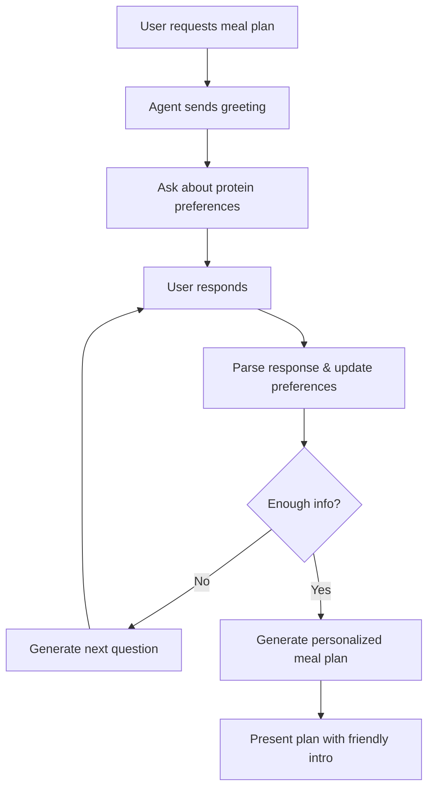

# Conversational Nutrition Planning Agent

## 🎯 Overview

The Nutrition Planning Agent has been upgraded to be a **proactive, conversational nutrition coach** that engages users in a natural dialogue before generating meal plans. Instead of immediately creating recommendations, it now:

1. ✅ **Greets users warmly** and explains the process
2. ✅ **Asks targeted questions** about dietary preferences
3. ✅ **Focuses on protein sources** (the most important macronutrient)
4. ✅ **Inquires about frequency** of consumption
5. ✅ **Discovers dislikes** and restrictions
6. ✅ **Adapts questions** based on user responses
7. ✅ **Generates personalized plans** only after gathering sufficient information

---

## 🆕 What's New

### Before (Direct Generation)
```python
# Old approach: Immediately generate meal plan
agent = NutritionPlanningAgent()
meal_plan, message = agent.plan_meals(health_metrics, user_profile)
```

### After (Conversational Flow)
```
USER: I'd like a meal plan

COACH: 👋 Hi! I'm your nutrition coach! Before I design your meals, 
       I'd love to learn about your food preferences...
       
       What are your favorite protein sources? Do you enjoy:
       - Red meat (beef, lamb, pork)?
       - Poultry (chicken breast, turkey)?
       - Eggs?
       - Fish and seafood?
       ...

USER: I love chicken and eggs, eat fish occasionally, but avoid red meat

COACH: Great choices! How often do you typically eat chicken and eggs? 
       Daily? A few times a week?

USER: Pretty much daily, maybe 5-6 times a week

COACH: Perfect! Are there any foods you dislike or avoid?

USER: I'm dairy-free and don't like mushrooms

COACH: ✅ Perfect! Based on your preferences, I've created a personalized 
       meal plan with chicken, eggs, and fish... [generates plan]
```

---

## 🏗️ Architecture Changes

### New Classes

#### `DietaryPreferences`
Tracks information gathered during the conversation:

```python
class DietaryPreferences(BaseModel):
    protein_preferences: list[str]      # e.g., ["chicken", "eggs", "fish"]
    protein_frequency: dict[str, str]   # e.g., {"chicken": "daily", "fish": "2x/week"}
    dislikes: list[str]                 # e.g., ["mushrooms", "olives"]
    restrictions: list[str]             # e.g., ["dairy-free", "gluten-free"]
    other_preferences: list[str]        # Other food preferences
    questions_asked: int                # Tracking progress
```

### New Methods

#### `create_greeting() -> str`
Generates a warm, welcoming initial message that explains the process and asks the first question about protein preferences.

#### `ask_next_question(preferences, conversation_history) -> str`
Uses LLM to generate contextually relevant follow-up questions based on:
- What information has already been gathered
- What's still missing
- The user's previous responses

**Prioritization:**
1. Protein sources (if not known)
2. Protein frequency (if proteins known but frequency missing)
3. Dislikes and restrictions
4. Other preferences

#### `parse_user_response(user_message, preferences) -> DietaryPreferences`
Intelligently extracts information from user's natural language responses:
- Identifies protein types mentioned
- Extracts frequency information ("daily", "3x/week", "occasionally")
- Detects dislikes and restrictions
- Updates the preferences object

#### Updated: `plan_meals(health_metrics, user_profile, dietary_prefs)`
Now accepts optional `dietary_prefs` parameter with detailed conversational data.

---

## 🔄 Conversation Flow



---

## 💬 Example Questions the Agent Asks

### Question 1: Protein Preferences (First Priority)
```
What are your favorite protein sources?

For example, do you enjoy:
- Red meat (beef, lamb, pork)?
- Poultry (chicken breast, turkey, duck)?
- Eggs?
- Fish and seafood (salmon, tuna, shrimp)?
- Dairy (Greek yogurt, cottage cheese)?
- Plant-based proteins (tofu, tempeh, beans, lentils)?
```

### Question 2: Frequency of Consumption
```
Great choices! How often do you typically eat chicken and fish? 
Daily? A few times a week? Let me know so I can balance your meals appropriately.
```

### Question 3: Dislikes and Restrictions
```
Are there any foods you dislike or need to avoid? 
This could be allergies, intolerances, foods you simply don't enjoy, 
or any dietary restrictions you follow.
```

### Adaptive Follow-ups
The agent adapts based on responses:
- If user mentions being vegetarian → Won't ask about meat preferences
- If user lists many proteins → May ask about cooking preferences
- If user mentions allergies → Will ask for clarification about severity

---

## 🚀 How to Use

### Option 1: Simulation Mode (Default)
See the agent in action with a pre-scripted conversation:

```bash
# Set your API key
$env:ANTHROPIC_API_KEY="your_key"

# Run simulation
python test_conversational_nutrition.py
```

This demonstrates a complete 4-turn conversation showing:
- Initial greeting
- Protein preference gathering
- Frequency questions
- Dislikes/restrictions
- Final meal plan generation

### Option 2: Interactive Mode
Have a real conversation with the agent:

```bash
# Set your API key
$env:ANTHROPIC_API_KEY="your_key"

# Run interactive mode
python test_conversational_nutrition.py interactive
```

You can then type your responses naturally and see how the agent adapts.

### Option 3: Programmatic Use

```python
from src.agents.nutrition_planning import nutrition_planning_node
from src.models.state import AgentState, HealthMetrics, UserProfile
from langchain_core.messages import HumanMessage

# Create state
state = AgentState(
    user_profile=UserProfile(
        age=30, gender="male", weight_kg=75.0, height_cm=178.0,
        activity_level="moderately_active", fitness_goal="maintain"
    ),
    health_metrics=HealthMetrics(
        target_calories=2000, protein_g=150, 
        carbs_g=200, fat_g=67, tdee=2200
    ),
    messages=[HumanMessage(content="I need a meal plan")]
)

# First interaction - gets greeting
state = nutrition_planning_node(state)
print(state.messages[-1].content)  # Agent's greeting

# User responds about proteins
state.messages.append(HumanMessage(
    content="I love chicken and eggs, but avoid red meat"
))
state = nutrition_planning_node(state)
print(state.messages[-1].content)  # Next question

# Continue conversation...
```

---

## 🎨 Design Principles

### 1. **Proactive Engagement**
- Agent initiates the conversation
- Explains why it's asking questions
- Builds rapport before making recommendations

### 2. **Targeted Questions**
- Specific, not generic
- "Do you like chicken breast or turkey?" vs "What proteins do you like?"
- Provides examples to guide responses

### 3. **Protein-First Approach**
- Protein is the hardest macro to hit
- Most important for meal plan success
- First 2-3 questions focus on protein sources and frequency

### 4. **Adaptive Intelligence**
- Uses LLM to understand natural language responses
- Generates contextually appropriate follow-ups
- Doesn't repeat already-asked questions

### 5. **Friendly Tone**
- Uses emojis appropriately
- Conversational, not robotic
- Shows enthusiasm and encouragement

### 6. **Information Sufficiency**
- Requires minimum 3 questions
- Must know protein preferences
- Must know at least one restriction/dislike/preference
- Uses `is_complete()` method to check readiness

---

## 🧪 Testing

### Unit Tests
The existing unit tests still work because `plan_meals()` can be called directly:

```bash
pytest tests/unit/test_nutrition_agent.py -v
```

All 19 tests pass ✅

### Integration Tests
Integration tests can simulate multi-turn conversations:

```python
def test_conversational_flow():
    state = create_initial_state()
    
    # Turn 1: Request
    state.messages.append(HumanMessage(content="meal plan please"))
    state = nutrition_planning_node(state)
    assert "protein" in state.messages[-1].content.lower()
    
    # Turn 2: Protein response
    state.messages.append(HumanMessage(content="chicken and eggs"))
    state = nutrition_planning_node(state)
    # Agent should ask about frequency or dislikes
    
    # Turn 3: More info
    state.messages.append(HumanMessage(content="daily, avoid dairy"))
    state = nutrition_planning_node(state)
    
    # Turn 4: Final info
    state.messages.append(HumanMessage(content="no mushrooms"))
    state = nutrition_planning_node(state)
    
    # Should have meal plan now
    assert state.meal_plan.total_calories > 0
```

---

## 📊 State Management

The agent stores conversation state in the user profile using a special format:

```python
# Preferences are serialized to JSON and stored with a marker
state.user_profile.dietary_preferences = [
    "__PREFS__:{...json data...}",
    "vegetarian",  # Other preferences can coexist
    "gluten-free"
]
```

This allows:
- ✅ Persistence across conversation turns
- ✅ Recovery if conversation is interrupted
- ✅ Compatibility with existing dietary_preferences field
- ✅ Easy reset after meal plan generation

---

## 🎯 Example Outputs

### Greeting Message
```
👋 Hi! I'm your nutrition coach, and I'm excited to create a personalized 
meal plan just for you!

Before I design your meals, I'd love to learn about your food preferences 
to make sure everything I recommend is something you'll actually enjoy eating.

Let me start with the most important question: **What are your favorite 
protein sources?**

For example, do you enjoy:
- Red meat (beef, lamb, pork)?
- Poultry (chicken breast, turkey, duck)?
- Eggs?
- Fish and seafood (salmon, tuna, shrimp)?
- Dairy (Greek yogurt, cottage cheese)?
- Plant-based proteins (tofu, tempeh, beans, lentils)?

Feel free to list as many as you like!
```

### Follow-up Question
```
That's great! Chicken and eggs are excellent protein sources. 

How often do you typically eat these throughout the week? For example:
- Daily (5-7 times per week)
- Several times a week (3-4 times)
- Occasionally (1-2 times)

And do you eat fish often as well, or is it more of an occasional choice?
```

### Final Meal Plan Intro
```
Perfect! Based on what you've told me about your preferences, I've created 
a personalized meal plan that includes your favorite proteins and respects 
your dietary needs. Here it is:

**Daily Meal Plan**
...
```

---

## 🔧 Configuration

The conversational agent uses:

```python
# Conversational LLM (for questions)
self.conversational_llm = get_chat_model(temperature=0.8)

# Structured LLM (for meal plans)
self.llm = get_chat_model(temperature=0.7).with_structured_output(DailyMealPlan)
```

Higher temperature (0.8) for conversational questions provides:
- More natural, varied phrasing
- Better adaptation to user responses
- Friendly, engaging tone

---

## 🚦 Minimum Information Required

Before generating a meal plan, the agent ensures:

```python
def is_complete(self) -> bool:
    return (
        self.questions_asked >= 3 and                      # At least 3 questions
        len(self.protein_preferences) > 0 and              # Know protein sources
        (len(self.restrictions) > 0 or                     # And have at least one:
         len(self.dislikes) > 0 or                         # - Restriction
         len(self.other_preferences) > 0)                   # - Dislike
    )                                                      # - Other preference
```

---

## 📈 Benefits

1. **Better Personalization**: Real dietary preferences, not assumptions
2. **Higher Adherence**: Users more likely to follow plans they helped design
3. **Engagement**: Interactive conversation vs one-way recommendation
4. **Discovery**: Users may discover preferences they hadn't considered
5. **Trust**: Agent shows genuine interest before advising
6. **Flexibility**: Can gather as much or as little detail as needed

---

## 🔜 Future Enhancements

Potential improvements:

1. **Meal Timing Preferences**: Ask when user prefers larger meals
2. **Cooking Skill Level**: Adjust recipe complexity
3. **Time Constraints**: Consider prep time preferences
4. **Budget Awareness**: Ask about cost sensitivity
5. **Cultural Preferences**: Cuisine types they enjoy
6. **Meal Prep**: Ask if batch cooking is preferred
7. **Portion Sizes**: Individual meal size preferences

---

## ✅ Summary

The Conversational Nutrition Planning Agent transforms the experience from:

❌ **Before**: "Here's a meal plan" (may not match preferences)

✅ **After**: "Let me learn about you first, then create something perfect for you"

This approach results in:
- More personalized recommendations
- Higher user satisfaction
- Better adherence to plans
- More engaging experience
- Trust-building through dialogue

Try it out with:
```bash
python test_conversational_nutrition.py
```

Enjoy your personalized nutrition coaching experience! 🥗✨

