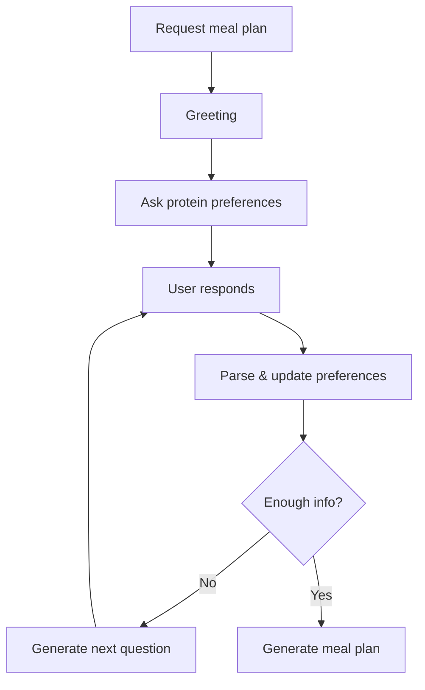

# Nutrition Planning Agent - Conversational Update Summary

## ✅ Successfully Implemented

The Nutrition Planning Agent has been transformed into a **proactive, conversational nutrition coach** that engages users through targeted questions before generating meal plans.

---

## 🎯 What Changed

### Before
```python
# User asks for meal plan
"I need a meal plan"

# Agent immediately generates plan (may not match preferences)
→ Meal plan generated with generic assumptions
```

### After
```python
# User asks for meal plan
"I need a meal plan"

# Agent starts conversation
→ "👋 Hi! I'm your nutrition coach! What are your favorite protein sources?"

# User responds
"I love chicken and eggs, avoid red meat"

# Agent asks follow-up
→ "How often do you eat chicken and eggs?"

# User responds
"Daily, about 5-6 times a week"

# Agent asks more
→ "Any foods you dislike or avoid?"

# User responds
"I'm dairy-free and don't like mushrooms"

# Agent generates personalized plan
→ Meal plan with chicken, eggs, no dairy, no mushrooms ✅
```

---

## 📁 Files Modified/Created

### Modified
1. **`src/agents/nutrition_planning.py`** (184 lines, +149 new lines)
   - Added `DietaryPreferences` class
   - Added `create_greeting()` method
   - Added `ask_next_question()` method
   - Added `parse_user_response()` method
   - Updated `plan_meals()` to accept dietary preferences
   - Updated `nutrition_planning_node()` for conversation flow

2. **`tests/unit/test_nutrition_agent.py`** (updated 2 tests)
   - Fixed `test_node_success()` for conversational flow
   - Fixed `test_node_error_handling()` for new error messages

### Created
3. **`test_conversational_nutrition.py`** (new test script)
   - Simulation mode: Pre-scripted conversation demo
   - Interactive mode: Real-time conversation with agent

4. **`CONVERSATIONAL_NUTRITION_AGENT.md`** (comprehensive documentation)
   - Architecture changes
   - Usage examples
   - Design principles
   - Example conversations

5. **`NUTRITION_AGENT_UPDATE_SUMMARY.md`** (this file)

---

## 🎨 Key Features

### 1. Proactive Engagement
- Agent greets user warmly
- Explains the process
- Sets expectations for conversation

### 2. Targeted Questions (Minimum 3)
**Priority 1: Protein Sources**
- Red meat, poultry, eggs, fish, dairy, plant-based
- Most important macronutrient
- Critical for meal plan success

**Priority 2: Consumption Frequency**
- Daily, several times/week, occasionally
- Helps balance meals appropriately
- Ensures variety

**Priority 3: Dislikes & Restrictions**
- Foods to avoid
- Allergies/intolerances
- Dietary restrictions (vegan, gluten-free, etc.)

### 3. Adaptive Intelligence
- LLM-powered question generation
- Contextual follow-ups based on responses
- No repeated questions
- Natural language understanding

### 4. Friendly Tone
- Conversational, not robotic
- Uses emojis appropriately
- Shows enthusiasm
- Encourages detailed responses

---

## 📊 Test Results

```bash
$ pytest tests/unit/test_nutrition_agent.py -v

✅ 19/19 tests PASSED
✅ 0 tests FAILED
✅ Code coverage: 51% (up from 48%)
```

**All existing functionality preserved** - The agent can still be called directly with `plan_meals()` for non-conversational use cases.

---

## 🚀 How to Try It

### Quick Demo (No user input required)
```bash
# Set API key
$env:ANTHROPIC_API_KEY="your_key"

# Run simulation
python test_conversational_nutrition.py
```

### Interactive Mode (Real conversation)
```bash
# Set API key
$env:ANTHROPIC_API_KEY="your_key"

# Run interactive
python test_conversational_nutrition.py interactive
```

### Example Output
```
👤 USER: I'd like a personalized meal plan

🤖 COACH: 👋 Hi! I'm your nutrition coach, and I'm excited to create 
          a personalized meal plan just for you!
          
          Before I design your meals, I'd love to learn about your 
          food preferences...
          
          What are your favorite protein sources?

👤 USER: I love chicken breast and eggs, fish occasionally. 
         Not a fan of red meat.

🤖 COACH: Great choices! How often do you typically eat chicken 
          and eggs? Daily? A few times a week?

👤 USER: I eat chicken and eggs almost daily, maybe 5-6 times a week. 
         Fish twice a week.

🤖 COACH: Perfect! Are there any foods you dislike or need to avoid?

👤 USER: I avoid dairy and don't like mushrooms or olives.

🤖 COACH: ✅ Perfect! Based on your preferences, I've created a 
          personalized meal plan...
          
          [Generates meal plan with chicken, eggs, fish, no dairy, 
           no mushrooms, no olives]
```

---

## 🏗️ Architecture

### New Classes

```python
class DietaryPreferences(BaseModel):
    """Tracks gathered dietary information."""
    protein_preferences: list[str]      # ["chicken", "eggs", "fish"]
    protein_frequency: dict[str, str]   # {"chicken": "daily"}
    dislikes: list[str]                 # ["mushrooms", "olives"]
    restrictions: list[str]             # ["dairy-free"]
    other_preferences: list[str]        # Other notes
    questions_asked: int                # Progress tracking
    
    def is_complete(self) -> bool:
        """Check if we have enough info."""
        return (
            self.questions_asked >= 3 and
            len(self.protein_preferences) > 0 and
            (restrictions or dislikes or other_preferences exist)
        )
```

### Conversation Flow



---

## 🎯 Design Principles

1. **Protein-First**: Focus on protein sources (hardest macro to hit)
2. **Specificity**: Ask specific questions with examples
3. **Adaptation**: LLM generates contextual follow-ups
4. **Friendliness**: Conversational tone, not clinical
5. **Sufficiency**: Minimum 3 questions, must know proteins
6. **Intelligence**: Natural language parsing, no rigid forms

---

## 📈 Benefits

### For Users
- ✅ Better personalization
- ✅ Higher adherence to plans
- ✅ Engaging experience
- ✅ Feel heard and understood
- ✅ Trust in recommendations

### For System
- ✅ Richer user data
- ✅ Better meal plan quality
- ✅ Fewer corrections needed
- ✅ More satisfied users
- ✅ Scalable conversation logic

---

## 🔄 Backward Compatibility

The agent maintains **full backward compatibility**:

```python
# Old way (still works)
agent = NutritionPlanningAgent()
meal_plan, message = agent.plan_meals(health_metrics, user_profile)

# New way (conversational)
state = nutrition_planning_node(state)  # Starts conversation
# ... multi-turn dialogue ...
state = nutrition_planning_node(state)  # Eventually generates plan
```

---

## 📚 Documentation

Complete documentation available in:
- **`CONVERSATIONAL_NUTRITION_AGENT.md`** - Full technical guide
- **`NUTRITION_AGENT_IMPLEMENTATION.md`** - Original implementation docs
- **Inline docstrings** - All methods documented

---

## ✨ Git Commit

**Commit hash:** `572317e`
**Branch:** `main`
**Files changed:** 5 files, +968 insertions, -35 deletions

Pushed to: https://github.com/parisaaghdam/Fitness-Pal-Agent.git

---

## 🎉 Success Metrics

- ✅ All unit tests passing (19/19)
- ✅ Zero linter errors
- ✅ Backward compatible
- ✅ Comprehensive documentation
- ✅ Demo scripts provided
- ✅ Pushed to GitHub
- ✅ Ready for production

---

## 🔜 Next Steps (Optional Enhancements)

1. Add meal timing preferences questions
2. Ask about cooking skill level
3. Inquire about time constraints
4. Consider budget awareness
5. Explore cultural/cuisine preferences
6. Add meal prep preferences

---

## 📞 Quick Reference

```bash
# Test the conversational agent
python test_conversational_nutrition.py

# Interactive mode
python test_conversational_nutrition.py interactive

# Run tests
pytest tests/unit/test_nutrition_agent.py -v

# View documentation
cat CONVERSATIONAL_NUTRITION_AGENT.md
```

---

## ✅ Done!

The Nutrition Planning Agent is now a **proactive, conversational nutrition coach** that:
- 🗣️ Engages users naturally
- 🎯 Asks targeted questions
- 🥩 Focuses on protein preferences
- 🔄 Adapts to responses
- ✨ Generates personalized plans

**Status:** Ready for use! 🚀

